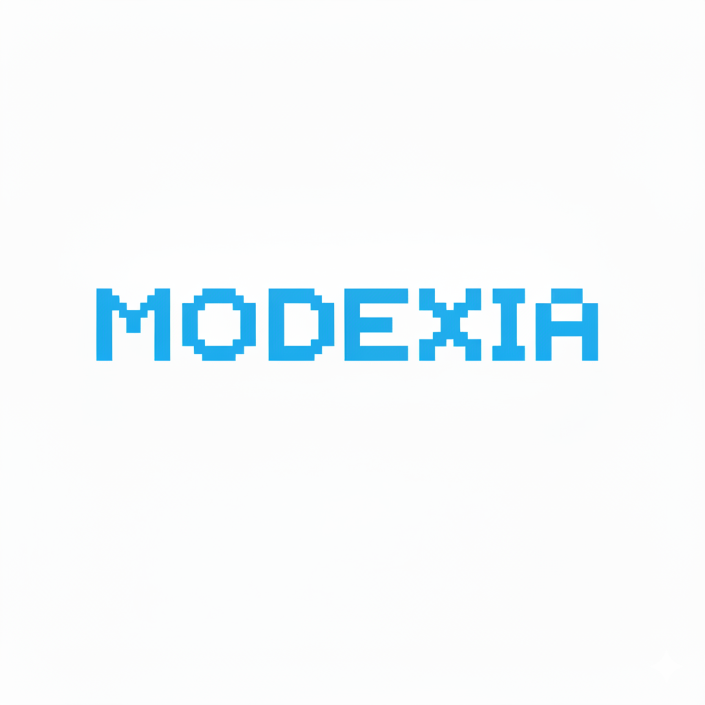

<div align="center">
  
  <h1>🚀 Modexia Ecosystem SDKs</h1>
  <p><b>Official client libraries for AI Agents and applications to seamlessly interact with Modexia's AgentPay API.</b></p>
  
  [](https://opensource.org/licenses/MIT)
</div>

<br />

Welcome to the **Modexia SDKs** monorepo! This repository houses all the official client libraries designed to give your AI agents and applications frictionless access to Modexia's wallet and payment infrastructure. Enable your systems to hold, manage, and transfer USDC with just a few lines of code.

---

## 🌟 Getting Started: Your API Key

Before integrating any of our SDKs, you will need a Modexia developer account and an API key. 

1. **Visit [modexia.software](https://modexia.software)**
2. Create or log into your developer account.
3. Navigate to your dashboard and generate your free **API Key**.
4. Check out our **[Full Documentation](https://modexia.software/docs)** for deep dives and advanced agentic payment flows.

---

## 🏗 System Architecture

The Modexia SDKs handle complex blockchain transactions, cryptographic signing, and HTTP retries under the hood, presenting your applications with a clean, unified interface.

```mermaid
graph TD;
    subgraph "Your Application Environment"
        App[📱 Your App / System]
        Agent[🤖 AI Agent]
        
        subgraph "Modexia SDKs"
            PySDK[🐍 Python SDK]
            TSSDK[📘 TypeScript / Node SDK<br/>(Coming Soon)]
        end
    end

    subgraph "Modexia Infrastructure"
        API[🌐 Modexia AgentPay API]
        DB[(Database & Wallets)]
    end

    subgraph "On-Chain"
        USDC[⛓️ USDC Smart Contracts]
    end

    App --> PySDK
    Agent --> PySDK
    App --> TSSDK
    
    PySDK -- "Secure REST API (API Key)" --> API
    TSSDK -- "Secure REST API (API Key)" --> API
    
    API <--> DB
    API -- "Broadcasts transactions" --> USDC
```

---

## 📦 Available Packages

| Language | Package | Version | Status | Documentation |
|----------|---------|---------|--------|---------------|
| **Python** | `modexiaagentpay` | [](https://badge.fury.io/py/modexiaagentpay) | V1 Ready 🟢 | [README](./SDKs/pythonSdk/README.md) |
| **Node.js** | `@modexia/agentpay` | `TBD` | Planned 🟡 | - |
| **Go** | `modexia-go` | `TBD` | Planned 🟡 | - |

> *Looking for another language? Open an issue and let us know!*

---

## ✨ Why Use Modexia SDKs?

- **Built for AI Agents:** Programmatic access to agent wallets and payments without complex blockchain cryptography.
- **Reliable Networking:** Built-in retry and exponential backoff mechanisms to gracefully handle transient network errors.
- **Clean Interfaces:** Minimalist, strongly-typed APIs across all supported languages.
- **Instant Settlement:** Built on USDC for fast and reliable global value transfer.

---

## 🤝 Contributing

We actively welcome community contributions to make these SDKs even better! 

1. **Fork & Branch:** Open a Pull Request targeting the `develop` branch.
2. **Backward Compatibility:** Please keep API contracts stable.
3. **Monorepo Structure:** Make sure you are working within the correct `SDKs/<language>Sdk` directory.

---

## 📄 License & Support

All SDKs in this repository are open-source and governed by the [MIT License](LICENSE).

Need help scaling your agent swarm? Hit rate limits? Reach out to our engineering team or explore the docs at [modexia.software](https://modexia.software).
