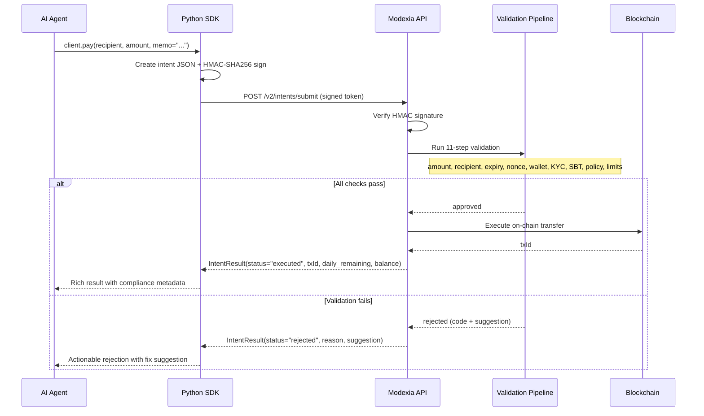
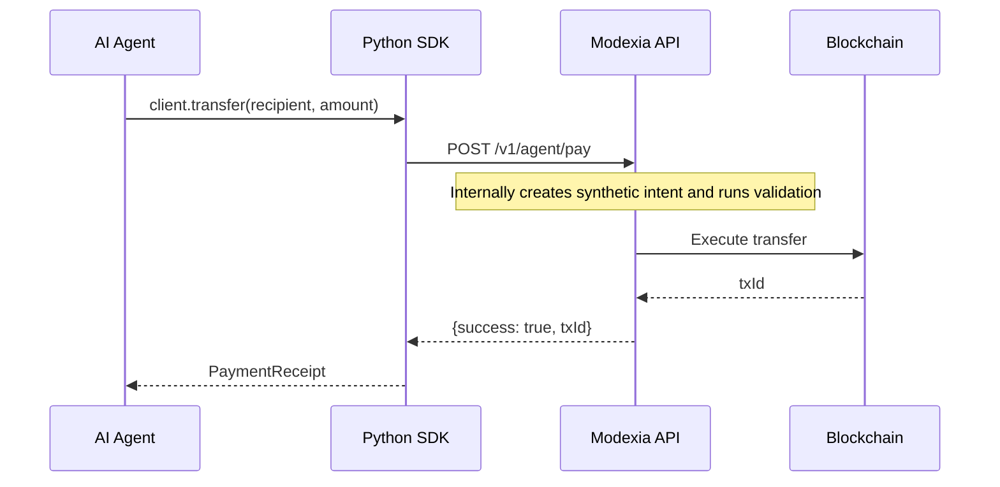
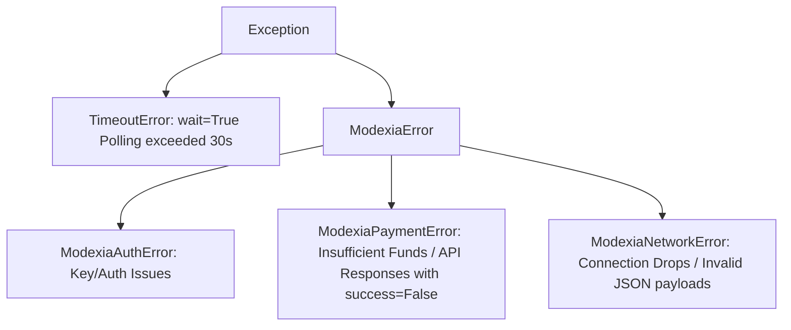

<div align="center">
  
  <h1>Modexia Python SDK</h1>
  <p><b>The ultimate Python client for AI Agents to seamlessly interact with Modexia's AgentPay API.</b></p>
  
  [](https://badge.fury.io/py/modexiaagentpay)
  [](https://pypi.org/project/modexiaagentpay/)
  [](https://opensource.org/licenses/MIT)
  [](https://github.com/psf/black)
</div>

<br />

Welcome to the **Modexia Python SDK** (`modexiaagentpay`). Built from the ground up to give your AI agents and Python applications frictionless access to Modexia's wallet and payment infrastructure. Enable your AI to hold, manage, and transfer value securely.

---

## What's New in v0.8.0

**Circle Gateway Nanopayments (x402)**
This release introduces full support for gas-free sub-cent microtransactions using Circle Gateway and EIP-3009 offline signatures.

| Feature | Description |
|---------|-------------|
| **`nanopay()`** | Core method to automatically negotiate and pay for `402 Payment Required` resources using offline EIP-3009 signatures. |
| **`nanopay_deposit()`** | Deposit funds from the main agent wallet into the off-chain Gateway. |
| **`nanopay_withdraw()`** | Withdraw unused funds from the Gateway back to the main wallet. |
| **`nanopay_balance()`** | Track the True Available Balance (Gateway deposits minus pending/unsettled signatures). |
| **Inline Auto-Refill** | If a nanopayment fails due to insufficient gateway funds, the SDK will automatically trigger a deposit and retry. |
| **`ModexiaPaymentError`** | New structured error handling cascading system with `code` and `details` attributes to explicitly track `INSUFFICIENT_GATEWAY_BALANCE` and `INSUFFICIENT_MAIN_BALANCE`. |
| **Async Support** | All nanopayment methods are fully implemented and optimized in `AsyncModexiaClient`. |

---

## Release History: v0.7.0 (Intent-to-Pay)

**Intent-to-Pay Pipeline**
A cryptographically signed payment system that gives agents rich compliance feedback, audit trails, and policy-aware spending.

| Feature | Description |
|---------|-------------|
| **`client.pay()`** | High-level intent-based payment — create, sign, submit, and poll in one call. |
| **`client.create_intent()`** | Create an HMAC-SHA256 signed intent token. |
| **`client.submit_intent()`** | Submit a signed token through the 11-step validation pipeline. |
| **`client.get_intent()`** | Look up the status of a previously submitted intent. |
| **`client.list_intents()`** | List recent intents for audit trail review. |
| **`IntentResult`** | Dataclass with status, compliance metadata, daily spend, and suggestions. |
| **`memo` parameter** | All payment methods accept a `memo` for audit trail visibility. |

---

## Getting Started: Your API Key

Before writing your first integration, you will need a Modexia developer account and an API key. 

1. **Visit [modexia.software](https://modexia.software)**
2. Create or log into your developer account.
3. Navigate to your dashboard and generate your **API Key**.

For deep dives, architecture, and advanced agentic payment flows, dive into our **[Full Documentation](https://modexia.software/docs)**.

---

## System Architecture & Flow

The SDK supports two payment flows: the classic **v1 transfer** and the new **v2 intent-based** pipeline.

### Intent-to-Pay Flow (v2 — Recommended)


```mermaid
sequenceDiagram
    participant Agent as AI Agent
    participant SDK as Python SDK
    participant API as Modexia API
    participant Pipeline as Validation Pipeline
    participant Chain as Blockchain

    Agent->>SDK: client.pay(recipient, amount, memo="...")
    SDK->>SDK: Create intent JSON + HMAC-SHA256 sign
    SDK->>API: POST /v2/intents/submit (signed token)
    API->>API: Verify HMAC signature
    API->>Pipeline: Run 11-step validation
    
    Note over Pipeline: amount, recipient, expiry, nonce, wallet, KYC, SBT, policy, limits

    alt All checks pass
        Pipeline-->>API: approved
        API->>Chain: Execute on-chain transfer
        Chain-->>API: txId
        API-->>SDK: IntentResult(status="executed", txId, daily_remaining, balance)
        SDK-->>Agent: Rich result with compliance metadata
    else Validation fails
        Pipeline-->>API: rejected (code + suggestion)
        API-->>SDK: IntentResult(status="rejected", reason, suggestion)
        SDK-->>Agent: Actionable rejection with fix suggestion
    end
```

### Classic Transfer Flow (v1 — Still Supported)


```mermaid
sequenceDiagram
    participant Agent as AI Agent
    participant SDK as Python SDK
    participant API as Modexia API
    participant Chain as Blockchain

    Agent->>SDK: client.transfer(recipient, amount)
    SDK->>API: POST /v1/agent/pay
    Note over API: Internally creates synthetic intent and runs validation
    API->>Chain: Execute transfer
    Chain-->>API: txId
    API-->>SDK: {success: true, txId}
    SDK-->>Agent: PaymentReceipt
```

> **Note:** The v1 `transfer()` method now internally routes through the same intent validation pipeline. You get the same compliance enforcement with zero code changes.

---

## Top-Level Features

- **Intent-Based Payments:** Cryptographically signed payment intents with HMAC-SHA256 verification, replay protection, and full compliance pipeline.
- **Rich Compliance Feedback:** Know exactly why a payment was rejected, with actionable suggestions and your daily spend/remaining budget.
- **Audit Trail:** Every payment records a `memo` explaining why the AI made the payment — visible in the dashboard.
- **Built for AI Agents:** Designed specifically for programmatic access to agent wallets and payments without complex cryptography.
- **Async & Swarm Support:** High-concurrency operations powered by fast implementations in both synchronous and `asyncio` models.
- **Fully Typed:** Returns robust Python dataclasses for exceptional developer experience and editor autocompletion.
- **Reliable Networking:** Built-in retry and exponential backoff mechanisms to gracefully handle transient network errors.

---

## Installation

```bash
pip install modexiaagentpay
```

---

## Quick Start Guide

### Circle Gateway Nanopayments (x402) - NEW in v0.8.0

For bypassing `402 Payment Required` paywalls with gas-free, sub-cent transactions:

```python
from modexia import ModexiaClient

client = ModexiaClient(api_key="mx_test_your_api_key_here")

# 1. Activate nanopayments for your agent (one-time)
client.nanopay_activate()

# 2. Deposit funds from your main wallet to the Gateway (on-chain)
# (Automatically handled by SDK if auto-refill is enabled)
client.nanopay_deposit(5.0)

# 3. Fetch an x402-protected resource — payment is automatically negotiated!
response = client.nanopay("https://api.premium-data.com/v1/weather", method="GET")

if response.success:
    print("Successfully purchased data!")
    print(f"Paid: {response.amount_paid} USDC")
    print(f"Data: {response.data}")
```

### Intent-Based Payment (v2 — Recommended)

The `pay()` method creates a signed intent, validates it through the compliance pipeline, and returns rich metadata.

```python
from modexia import ModexiaClient

client = ModexiaClient(api_key="mx_test_your_api_key_here")

# Make a payment with full compliance feedback
result = client.pay(
    recipient="0xabc123456789def0123456789abc0123456789def",
    amount=5.0,
    memo="Paying for GPT-4 API call to summarize document #42"
)

if result.status == "executed":
    print(f"Payment executed! TX ID: {result.txId}")
    print(f"Balance after: {result.wallet_balance_after} USDC")
    print(f"Daily remaining: {result.daily_remaining} USDC")
elif result.status == "rejected":
    print(f"Rejected: {result.reason}")
    print(f"Suggestion: {result.suggestion}")
```

### Classic Transfer (v1 — Backwards Compatible)

```python
from modexia import ModexiaClient

client = ModexiaClient(api_key="mx_test_your_api_key_here")

# Check balance
balance = client.retrieve_balance()
print(f"Balance: {balance} USDC")

# Simple transfer (still works, now with memo support)
receipt = client.transfer(
    recipient="0xabc123456789def0123456789abc0123456789def",
    amount=5.0,
    wait=True,
    memo="Paying vendor for compute resources"
)

if receipt.success:
    print(f"Transfer successful! TX ID: {receipt.txId}")
```

### Async Usage (Swarm Mode)

For high-concurrency loops or AutoGPT-style agent networks:

```python
import asyncio
from modexia import AsyncModexiaClient

async def main():
    async with AsyncModexiaClient(api_key="mx_test_your_api_key_here") as client:
        await client.validate_session()

        # Intent-based payment (recommended)
        result = await client.pay(
            "0xabc...", 5.0,
            memo="Async swarm payment for data processing"
        )
        print(f"Status: {result.status}, Daily remaining: {result.daily_remaining}")

        # Or classic transfer
        receipt = await client.transfer("0xabc...", 2.0, memo="Legacy flow")
        print(f"TX: {receipt.txId}")

asyncio.run(main())
```

---

## API Reference

### `ModexiaClient` & `AsyncModexiaClient`
The core classes for all network operations.

```python
ModexiaClient(
    api_key: str, 
    timeout: int = 15, 
    base_url: Optional[str] = None, 
    validate: bool = True
)
```

### Circle Gateway Nanopayments (x402) - v0.8.0

| Method | Description | Returns |
|--------|-------------|---------|
| `nanopay_activate()` | Activate the gateway for this wallet. Idempotent. | `dict` |
| `nanopay_deposit(amount)` | Deposit funds from main wallet to gateway. | `dict` |
| `nanopay(url, method)` | Auto-negotiates `402 Payment Required` using EIP-3009 signatures. Includes auto-refill logic. | `NanopayResponse` |
| `nanopay_balance()` | Get True Available gateway balance and auto-refill status. | `NanopayBalance` |
| `nanopay_withdraw(amount)` | Initiate a withdrawal from gateway back to main wallet. | `dict` |

### Intent-to-Pay Methods (v2)

| Method | Description | Returns |
|--------|-------------|---------|
| `pay(recipient, amount, memo=None, wait=True)` | **Recommended.** High-level intent-based payment — creates, signs, submits, and polls. Returns rich compliance metadata. | `IntentResult` |
| `create_intent(recipient, amount, memo=None, action="transfer", ttl_seconds=300)` | Create a signed intent token locally (no network call). The token is `base64url(payload).hex(hmac_sha256(payload, api_key))`. | `str` |
| `submit_intent(intent_token)` | Submit a signed intent token for validation and execution. | `IntentResult` |
| `get_intent(intent_id)` | Retrieve the status of a previously submitted intent by UUID. | `IntentResult` |
| `list_intents(limit=20)` | List recent payment intents for audit trail review. | `List[IntentResult]` |

### Classic Methods (v1)

| Method | Description | Returns |
|--------|-------------|---------|
| `retrieve_balance()` / `get_balance()` | Fetches the current available balance of your agent's wallet. | `str` |
| `transfer(recipient, amount, idempotency_key=None, wait=True, memo=None)` | Send funds to a destination. Uses intent-hashing to prevent duplicate charges. | `PaymentReceipt` |
| `cross_chain_transfer(to_chain, to_token, recipient, amount)` | Cross-chain CCTP transfer via Squid Router. | `PaymentReceipt` |
| `get_history(limit=5)` | Fetch the recent transaction history for Agent memory. Now includes `memo`. | `TransactionHistoryResponse` |

### Vault / Micropayment Channel Methods

| Method | Description | Returns |
|--------|-------------|---------|
| `open_channel(provider, deposit, duration_hours=24)` | Open a payment channel with on-chain deposit. | `dict` |
| `consume_channel(channel_id, amount, idempotency_key=None)` | Execute an instant, gas-free micro-payment inside a channel. | `ConsumeResponse` |
| `settle_channel(channel_id)` | Settle a channel on-chain — pays provider, refunds remainder. | `dict` |
| `get_channel(channel_id)` | Get the current status of a payment channel. | `ChannelStatus` |
| `list_channels(limit=50)` | List all payment channels for the authenticated agent. | `List[ChannelStatus]` |

### Other

| Method | Description | Returns |
|--------|-------------|---------|
| `smart_fetch(method, url, **kwargs)` | Legacy auto-negotiation (pre-Gateway). | `Response` |

---

## Data Models

### `IntentResult`

The rich response returned from the intent-to-pay pipeline:

```python
@dataclass
class IntentResult:
    status: str                          # pending | approved | rejected | executed | failed
    intent_id: Optional[str]             # UUID for tracking
    # Transaction details (populated on 'executed')
    txId: Optional[str]                  # Circle transaction ID
    txIds: Optional[List[str]]           # Multiple IDs for multi-leg txs
    txState: Optional[str]               # PENDING → COMPLETE
    amount: Optional[str]                # e.g. "5.00"
    recipient: Optional[str]             # 0x... address
    # Compliance & policy metadata
    wallet_balance_after: Optional[str]  # Balance after payment
    daily_spent: Optional[str]           # How much spent today
    daily_remaining: Optional[str]       # Budget remaining today
    # Rejection info
    reason: Optional[str]                # Why it was rejected
    code: Optional[str]                  # Machine-readable code
    suggestion: Optional[str]            # Actionable fix suggestion
    # Full validation pipeline results
    validation: Dict[str, Any]           # Per-step validation outcomes
```

### `PaymentReceipt`

```python
@dataclass
class PaymentReceipt:
    success: bool
    status: str              # "PENDING" | "COMPLETE"
    txId: Optional[str]
    txHash: Optional[str]
    errorReason: Optional[str]
```

### `TransactionHistoryItem`

```python
@dataclass
class TransactionHistoryItem:
    txId: str
    type: str
    amount: str
    state: str
    createdAt: str
    providerAddress: Optional[str]
    txHash: Optional[str]
    memo: Optional[str]
```

---

## Exception Handling

The SDK provides robust error mapping to help your agent gracefully recover from failures. You can import these directly from the `modexia` package:

```python
from modexia import ModexiaClient, ModexiaAuthError, ModexiaPaymentError, ModexiaNetworkError
```


```mermaid
graph TD;
    Exception-->TimeoutError["TimeoutError: wait=True Polling exceeded 30s"];
    Exception-->ModexiaError;
    ModexiaError-->ModexiaAuthError["ModexiaAuthError: Key/Auth Issues"];
    ModexiaError-->ModexiaPaymentError["ModexiaPaymentError: Insufficient Funds / API Responses with success=False"];
    ModexiaError-->ModexiaNetworkError["ModexiaNetworkError: Connection Drops / Invalid JSON payloads"];
```

---

## Intent Token Format

The intent token is a compact, tamper-proof string:

```
base64url(canonical_json).hex(hmac_sha256(canonical_json, api_key))
```

**Canonical JSON** is the payload with keys sorted alphabetically and serialized with no whitespace:

```json
{"action":"transfer","amount":"5.0","currency":"USDC","expiresAt":1715270400000,"idempotencyKey":"uuid","memo":"Paying for API call","nonce":1715270100000,"recipient":"0x..."}
```

The HMAC-SHA256 signature uses your API key as the secret. The backend verifies this signature using constant-time comparison to prevent timing attacks.

---

## Migration from v0.6.x

v0.7.0 and v0.8.0 are **fully backwards compatible**. No changes needed for existing code.

**What's different internally:** The `transfer()` method routes through the same validation pipeline as `pay()`. Your existing code gets compliance enforcement for free.

**To adopt v2 features:**
```diff
- receipt = client.transfer("0x...", 5.0)
- if receipt.success:
-     print(f"TX: {receipt.txId}")

+ result = client.pay("0x...", 5.0, memo="Paying for compute")
+ if result.status == "executed":
+     print(f"TX: {result.txId}, Remaining: {result.daily_remaining}")
```

---

## Contributing to Open Source

We actively welcome community contributions to make this SDK even better. 

1. **Fork & Branch:** Open a Pull Request targeting the `develop` branch.
2. **Backward Compatibility:** Please keep API contracts stable. `ModexiaClient`, `transfer()`, and `retrieve_balance()` are canonical.
3. **Testing:** Make sure tests pass locally before submitting.

```bash
# Run tests from the repository root
pytest -q packages/SDKs/pythonSdk
```

---

## License & Support

**modexiaagentpay** is open-source and governed by the [MIT License](LICENSE).

Need help scaling your agent swarm? Reach out to our engineering team or explore the docs at [modexia.software](https://modexia.software).
